# Week 05 Product Landing Page

## Introduction

A product landing page is a focused web page designed to explain an offering, show its value, and guide visitors toward one clear action. Unlike a general website homepage, a landing page keeps its content and navigation centered on a campaign, product, service, or conversion goal.

Landing pages matter because they give businesses a direct place to communicate their value proposition, build trust, answer common questions, and turn interest into action. A well-structured landing page can support sign-ups, free trials, bookings, sales conversations, and other measurable business outcomes.

This project is a static marketing landing page for **Hearth & Harbor**, a fictional hospitality software business for independent hotels, inns, and guesthouses. It demonstrates a complete Laravel Blade page with reusable components for navigation, hero content, features, product showcase, pricing, testimonials, calls to action, and the footer.

## Objectives

This project accomplishes the following intended learning outcomes (ILOs):

- Build a complete product landing page with Laravel Blade and Vite.
- Apply mobile-first responsive web design principles.
- Use Tailwind CSS utility classes for layout, spacing, typography, color, and interaction states.
- Create reusable Blade components with props, slots, and attribute forwarding.
- Organize a landing page into maintainable layouts, pages, and components.
- Design a consistent user interface with clear visual hierarchy and conversion-focused calls to action.
- Validate the page at mobile, tablet, and desktop widths.

## Responsive Web Design

### Mobile-first design

The page starts with a single-column layout and expands at larger breakpoints. This keeps the most important content readable and usable on small screens before adding desktop enhancements.

For example, the hero buttons stack on small screens and become a row from the `sm` breakpoint upward:

```blade
<div class="mt-9 flex flex-col gap-3 sm:flex-row sm:items-center">
    <x-button href="#get-started" size="lg">Get Started</x-button>
    <x-button href="#features" variant="outline" size="lg">Learn More</x-button>
</div>
```

### Breakpoints

The project uses Tailwind's responsive variants:

- Default classes target mobile screens.
- `sm:` adds styles for small tablet-sized screens and above.
- `md:` switches the navigation between mobile and desktop states.
- `lg:` creates multi-column desktop layouts and increases spacing.

The page was checked at 375px, 768px, and 1280px widths. Sections avoid horizontal overflow, cards stack on narrow screens, and desktop grids use the available width efficiently.

### Flexbox

Flexbox handles one-dimensional alignment, such as the navigation bar, button groups, CTA content, and testimonial identity rows:

```blade
<div class="flex h-20 items-center justify-between">
    <a href="#home" class="flex items-center gap-3 text-stone-900">
        <span class="flex h-10 w-10 items-center justify-center rounded-full bg-amber-700 text-lg font-semibold text-white">H</span>
        <span class="text-lg font-semibold tracking-tight">Hearth <span class="font-normal text-amber-700">&amp;</span> Harbor</span>
    </a>
</div>
```

### CSS Grid

Grid handles two-dimensional page sections and repeated card collections. The Features section uses one column on mobile, two columns at `sm`, and three columns at `lg`:

```blade
<div class="mt-12 grid grid-cols-1 gap-6 sm:grid-cols-2 lg:grid-cols-3">
    <x-feature-card icon="calendar" title="Effortless reservations" description="Keep every booking organized with a clear calendar built for busy independent properties." />
    <x-feature-card icon="users" title="Guest profiles" description="Remember preferences and important details so every welcome feels personal." />
    <x-feature-card icon="chart" title="Steady growth insights" description="See occupancy, revenue, and booking trends at a glance with simple reports." />
</div>
```

### UX considerations

Responsive design matters because visitors may arrive from phones, tablets, or large monitors. The layout keeps text readable, preserves generous spacing, stacks important controls when needed, and gives interactive controls touch-friendly hit areas. The mobile navigation button and links use a minimum 44px target height, while footer social links use 44px square targets.

## Tailwind CSS

Tailwind CSS is a utility-first CSS framework. Instead of creating a large set of bespoke selectors, the project composes small utilities directly in the Blade markup. Utilities describe the visual result, such as `rounded-2xl`, `shadow-sm`, `grid-cols-1`, `lg:grid-cols-3`, and `text-stone-600`.

### Advantages in this project

- Fast iteration without switching between template and stylesheet files.
- Responsive styles remain next to the markup they control.
- Shared visual patterns are easy to recognize across components.
- State variants such as `hover:`, `active:`, and `focus-visible:` are explicit.
- Tailwind removes unused generated styles during the production build.

The CSS entrypoint is intentionally small:

```css
@import "tailwindcss";
```

Vite loads the CSS and JavaScript entrypoints through `vite.config.js`:

```js
laravel({
    input: ['resources/css/app.css', 'resources/js/app.js'],
    refresh: true,
}),
tailwindcss(),
```

### Responsive utility classes

The pricing section combines default mobile behavior with desktop columns:

```blade
<div class="mx-auto mt-12 grid max-w-6xl grid-cols-1 gap-6 lg:grid-cols-3 lg:items-center">
    <x-pricing-card plan-name="Basic" price="$39" :features="[...]" cta-text="Start with Basic" />
    <x-pricing-card plan-name="Signature" price="$89" :is-featured="true" :features="[...]" cta-text="Choose Signature" />
    <x-pricing-card plan-name="Estate" price="$159" :features="[...]" cta-text="Choose Estate" />
</div>
```

### Component styling

The reusable button centralizes variants, sizes, transitions, and focus styles:

```blade
@php
    $baseClasses = 'inline-flex min-h-11 items-center justify-center gap-2 rounded-xl font-semibold transition duration-200 ease-out hover:-translate-y-0.5 active:translate-y-0 active:scale-[0.98] focus:outline-none focus-visible:ring-2 focus-visible:ring-amber-700 focus-visible:ring-offset-2';
    $variantClasses = [
        'primary' => 'bg-amber-700 text-white hover:bg-amber-800',
        'secondary' => 'bg-stone-100 text-stone-800 hover:bg-stone-200',
        'outline' => 'border border-stone-300 bg-transparent text-stone-700 hover:border-amber-700 hover:bg-amber-50 hover:text-amber-800',
    ][$variant] ?? 'bg-amber-700 text-white hover:bg-amber-800';
@endphp
```

The component then renders an anchor when `href` is supplied and a button otherwise:

```blade
@if ($href)
    <a href="{{ $href }}" {{ $attributes->merge(['class' => $classes]) }}>{{ $slot }}</a>
@else
    <button type="{{ $attributes->get('type', 'button') }}" {{ $attributes->except('type')->merge(['class' => $classes]) }}>{{ $slot }}</button>
@endif
```

## Blade Components

Blade components are reusable view units that can receive props and slot content. In this project, files in `resources/views/components/` are used with tags such as `<x-hero />`, `<x-button>Get Started</x-button>`, and `<x-pricing-card ... />`.

Reusable components improve maintainability because a visual or behavioral change can be made in one place. They also prevent repeated markup from drifting apart, make pages easier to scan, and allow each component to own its layout and presentation details.

### Layout composition

The master layout places the shared navbar and footer around page content:

```blade
<body class="antialiased">
    <x-navbar />
    @yield('content')
    <x-footer />
</body>
```

The home page extends that layout and composes the page from sections and components:

```blade
@extends('layouts.app')

@section('title', 'Hearth & Harbor | Make every stay feel like home')

@section('content')
    <x-hero />
    {{-- Features, showcase, pricing, testimonials, and CTA sections follow. --}}
@endsection
```

### Props and slots

The pricing card accepts structured data and uses a loop for its feature list:

```blade
@props([
    'planName',
    'price',
    'features' => [],
    'isFeatured' => false,
    'ctaText' => 'Subscribe',
])

<ul class="mt-8 space-y-4 border-t border-stone-200 pt-7">
    @foreach ($features as $feature)
        <li class="flex gap-3 text-sm leading-6 text-stone-600">
            <span class="mt-0.5 flex h-5 w-5 shrink-0 items-center justify-center rounded-full bg-amber-100 text-xs font-bold text-amber-700" aria-hidden="true">&#10003;</span>
            <span>{{ $feature }}</span>
        </li>
    @endforeach
</ul>
```

The testimonial card uses props for a photo, identity, and review while keeping the card markup consistent:

```blade
@props([
    'photo',
    'name',
    'position',
    'review',
])


<blockquote class="relative mt-7 flex-1 pl-5 text-lg leading-8 text-stone-700">
    <span class="absolute -left-1 -top-2 font-serif text-5xl leading-none text-amber-300" aria-hidden="true">&ldquo;</span>
    <p>{{ $review }}</p>
</blockquote>
```

The reusable component files are collected in the project components folder:

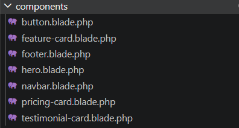

## User Interface Design

- **Color palette:** Warm amber and orange tones communicate hospitality and welcome. Stone neutrals keep the interface calm and readable. The primary background uses `#fffaf5`, while the footer uses `bg-stone-950` for contrast.
- **Typography:** Large, tight hero and section headings create hierarchy. Body copy uses readable sizes and line heights such as `text-lg leading-8`. Small uppercase labels use tracking to create clear section markers.
- **Iconography:** Feature cards use inline Heroicon-style SVG paths, while footer social links use simple inline SVG icons. Decorative icons are marked `aria-hidden="true"` so they do not interrupt screen-reader content.
- **Button styles:** The reusable `x-button` supports `primary`, `secondary`, and `outline` variants plus `sm`, `md`, and `lg` sizes. Buttons include hover, active, focus-ring, and minimum touch-target styling.
- **Card design:** Feature, pricing, and testimonial cards use restrained borders, rounded corners, white surfaces, subtle shadows, and a small hover lift. The Signature pricing card adds a highlighted amber border, a “Most Popular” badge, and a small desktop scale increase.
- **Layout consistency:** Page sections share `max-w-7xl`, responsive horizontal padding, generous vertical spacing, and recurring amber section labels. This makes separate sections feel like one product experience.

## Folder Structure

```text
week05-product-landing-page/
├── app/                    # Laravel application classes
├── public/                 # Web root, compiled assets, index.php, and static files
├── resources/
│   ├── css/                # Tailwind CSS entrypoint
│   ├── js/                 # Vite JavaScript entrypoint and navbar behavior
│   └── views/
│       ├── layouts/         # Shared Blade master layout
│       ├── components/      # Reusable Blade UI components
│       └── pages/            # Page-level Blade views such as home.blade.php
├── routes/                 # Web and API route definitions
├── screenshots/             # Project screenshots and visual evidence
├── documentation/          # Supporting project documentation
├── tests/                  # Laravel feature and unit tests
├── package.json             # NPM scripts and frontend dependencies
├── vite.config.js          # Laravel Vite and Tailwind plugin configuration
└── artisan                 # Laravel command-line entrypoint
```

- `resources/views/layouts/` contains `app.blade.php`, which defines the HTML boilerplate, Vite assets, shared navbar, page slot, and shared footer.
- `resources/views/components/` contains reusable UI such as `button.blade.php`, `navbar.blade.php`, `hero.blade.php`, `feature-card.blade.php`, `pricing-card.blade.php`, `testimonial-card.blade.php`, and `footer.blade.php`.
- `resources/views/pages/` contains full page views. `home.blade.php` extends the app layout and assembles the landing page sections.
- `public/` is Laravel's public web root and contains the generated Vite build output in `public/build/`.
- `screenshots/` is reserved for desktop, tablet, mobile, and section screenshots.
- `documentation/` is reserved for additional project notes, research, or delivery documentation.

## Screenshots

The following screenshots document the completed landing page at the required responsive sizes and section views.

### Responsive views

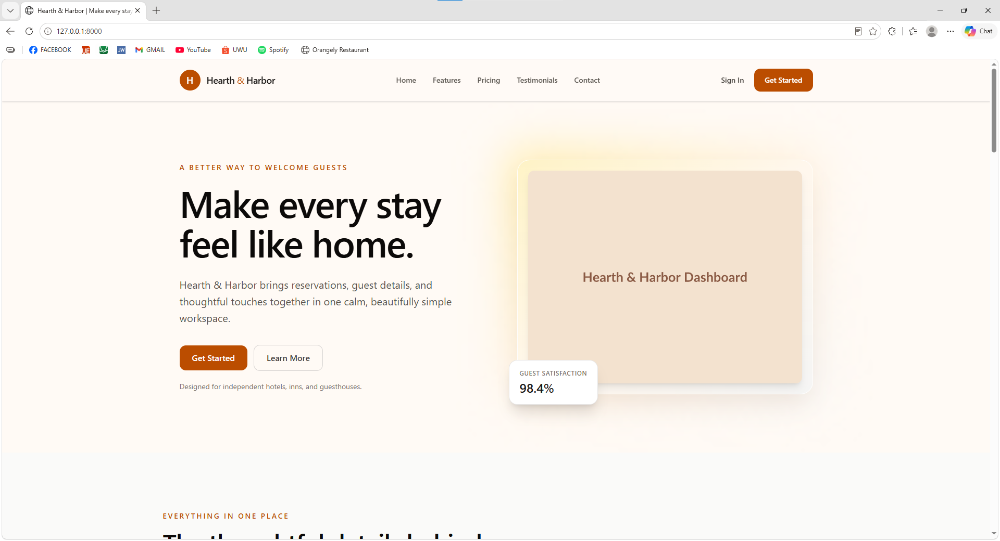

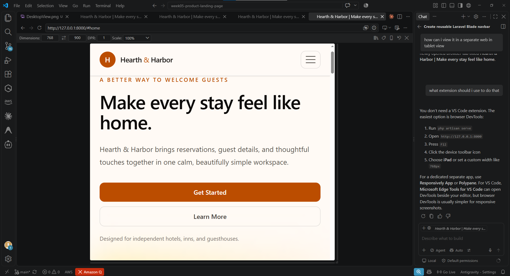

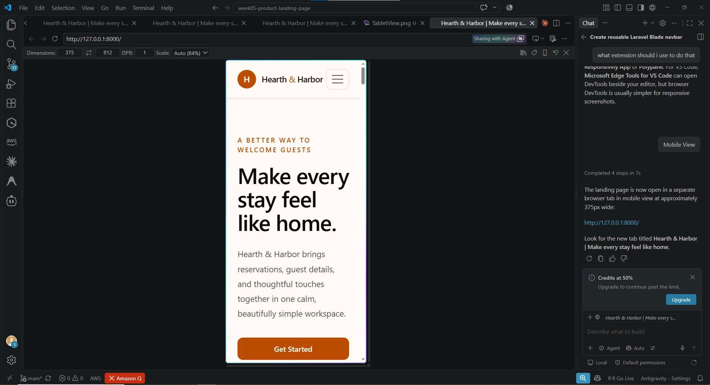

### Page sections

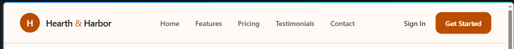

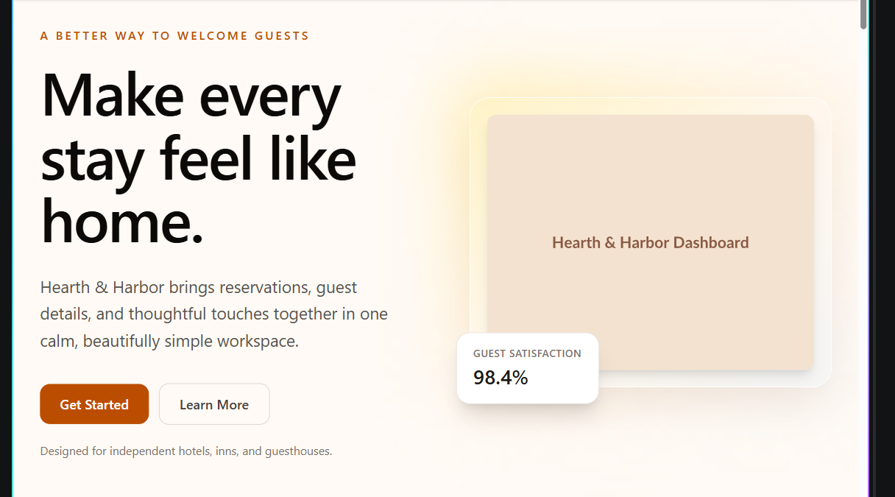

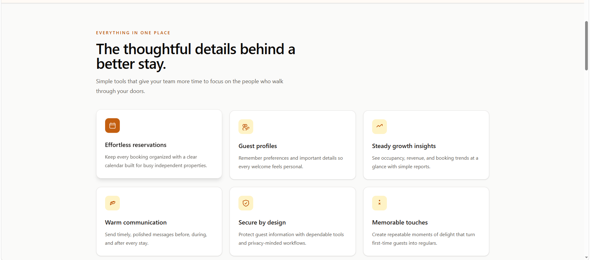

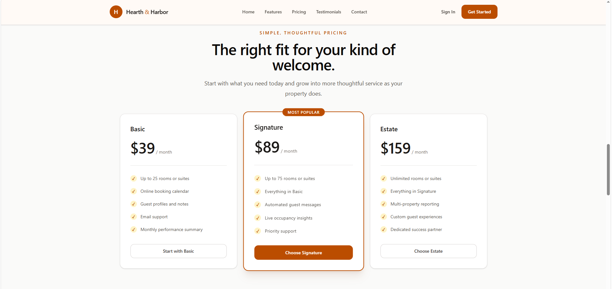

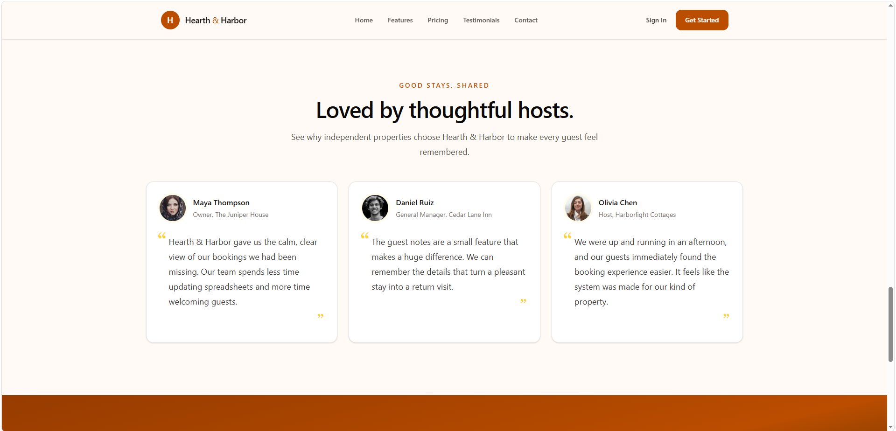

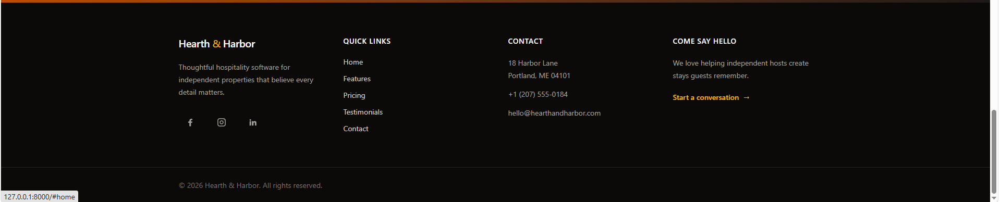

### Project evidence

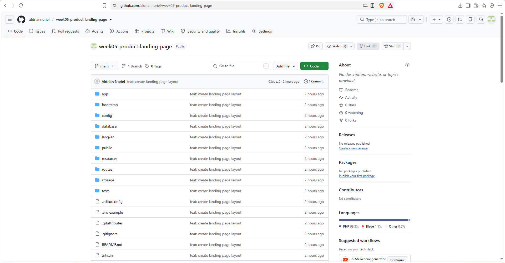

## Running the Project

Install PHP and Node dependencies, then start the Laravel and Vite development servers in separate terminals:

```powershell
composer install
npm install
php artisan key:generate
php artisan serve
npm run dev
```

Open `http://127.0.0.1:8000` to view the landing page. For a production asset build, run:

```powershell
npm run build
```

This project currently uses static Blade content and does not require a database for the landing page.
